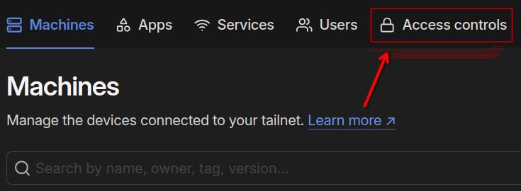
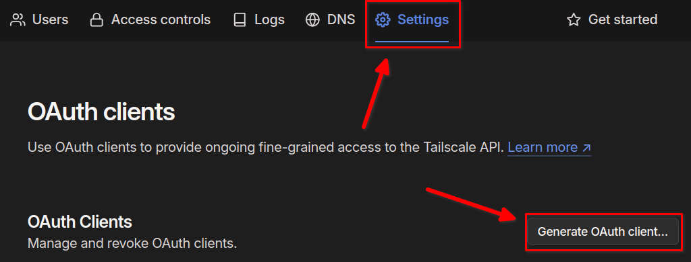
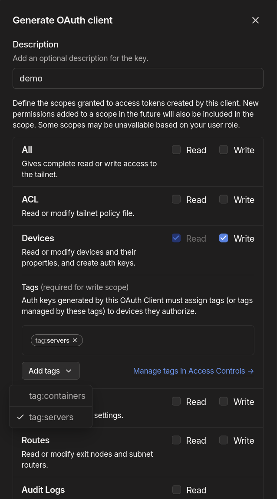

# Tailscale
My homelab playbook and [roles](https://galaxy.ansible.com/ui/repo/published/joshrnoll/homelab/) are built around my usage of [Tailscale](https://tailscale.com). If you're unfamiliar with Tailscale, the TL;DR is that it's a peer-to-peer mesh network built on Wireguard, and it's incredibly easy to use. With Tailscale, I never have to open ports in my firewall or expose anything directly to the internet. If I add it to my tailnet, I can access it anywhere, from anything that can run tailscale (which is most things). 


## How I Automate It
Both servers and containers are automatically added to my tailnet with Ansible. This is done with a mix of the [artis3n.tailscale](https://galaxy.ansible.com/ui/standalone/roles/artis3n/tailscale/) module (for physical machines and VMs) and using a Tailscale 'sidecar' container to connect docker containers directly to my tailnet as outlined in this [article](https://tailscale.com/blog/docker-tailscale-guide). Architecturally, the sidecar container looks like this:


### Step One - Configuring Tags

Authenticating to tailscale programmatically requires an [OAuth client](https://tailscale.com/kb/1215/oauth-clients), which can be created in the Tailscale admin console. When creating an OAuth client, you need to select a [tag](https://tailscale.com/kb/1068/tags). **Your tailnet will not have any tags configured by default.** 

First, you'll need to create an [ACL tag](https://tailscale.com/kb/1068/acl-tags?q=acl%20tags) in your tailscale access controls file. This can be done by selecting the ```Access controls``` tab in the Admin console and editing the file directly in the Web UI. 



The section for tags will be commented out by default, and will look something like this:

```	
// Define the tags which can be applied to devices and by which users.
	//"tagOwners": {
	//  	"tag:example":["autogroup:admin"],
	// },
```
Uncommenting this section and making no changes will tag anything owned by the ```autogroup:admin``` as ```example```. Obviously, you probably want to change the tag to something other than ```example```, but you can leave the user section if you need the flexibility of allowing multiple different admins to create OAuth clients and add things to your tailnet through automation tools. 

However, for a homelab, I recommend you restrict this to your account only. To do this, change ```"autogroup:admin"``` to the email of your Tailscale admin account. 

The below example does this and creates two tags: one for ```servers``` and one for ```containers```. 

```
// Define the tags which can be applied to devices and by which users.
	"tagOwners": {
		"tag:containers": ["your.email@example.com"],
		"tag:servers":    ["your.email@example.com"],
	},
```
You can call the tags anything you want. You just have to tag the OAuth key with *something*. You can also choose to add multiple tags to an Oauth client. 

### Step Two - Creating an OAuth Client
 Now we need to create the OAuth clients. From the admin console, select ***Settings*** then ***Generate OAuth client...***



Ensure you give the OAuth Client ***Read and Write access to Devices***. If you don't have any tags to pick from, [go back to step one](#step-one---configuring-tags) to make sure your tags were created properly. Circle back to this section when you're done.



**MAKE NOTE OF THE CLIENT SECRET**

You won't be shown the secret again. I highly recommend you store this in a password manager. My current choice is [Bitwarden](https://bitwarden.com). If you lost the secret, make sure you go back, revoke the client and make it again.

I recommend you create one OAuth client for your servers, and tag it with the ```servers``` tag. Do the same for containers, tagging them with the ```containers``` tag. You can choose to use the same OAuth client for both servers and containers if you want, and tag them however you wish. Doing it this way will make it clear in your admin console which devices are containers and which are physical/virtual servers. 

#### Authkey

Optionally, you can also use a tailscale [authkey](https://tailscale.com/kb/1085/auth-keys), however these have a maximum lifetime of 90 days. I don't use them, and I don't test any of my playbooks or roles with them, so functionality with any of my tooling is **NOT** guaranteed.

#### Adding Your Secret to Ansible Vault

[Ansible vault](https://docs.ansible.com/ansible/latest/vault_guide/index.html) makes it really easy to store sensitive variables securely. In a nutshell, the file is encrypted, but providing the vault password when running your playbook allows Ansible to read and use the variables securely. So you can, in theory, securely commit these files to a remote git repo. Though, I still recommend adding them to your .gitignore file. 

Creating a vault file is very simple. It looks like this:

```
ansible-vault create secrets.yml
```

You can also use ```ansible-vault edit``` and ```ansible-vault view``` at any point to go back and edit/view your vault file. 

The contents of the file should look like this:

```YAML
tailscale_containers_oauth_client:
  key: <your oauth client secret here>
tailscale_servers_oauth_client:
  key: <your oauth client secret here>
```

##### Why Dictionary Format?
I discovered in testing that the variable containing your OAuth client secret/authkey must be in dictionary/hash format for it to work with the [artis3n.tailscale](https://galaxy.ansible.com/ui/standalone/roles/artis3n/tailscale/) role. So, for consistency, I store both the servers and the containers secrets this way. 

### Using Your OAuth Client
Here's an example playbook that uses the OAuth client secret:

```YAML
- name: A playbook that needs your Tailscale OAuth client secret
  hosts: all
  tasks:
    - name: Include variables from Ansible vault file
      include_vars: secrets.yml
    
    - name: Install Uptime Kuma 
      include_role:
        name: joshrnoll.homelab.tailscale_container
      vars:
        tailscale_container_oauth_client_secret: "{{ tailscale_containers_oauth_key['key'] }}"
        tailscale_container_service_name: uptime-kuma
        tailscale_container_container_image: louislam/uptime-kuma
        tailscale_container_container_tag: latest
        tailscale_container_serve_port: 3001
        tailscale_container_public: false
        tailscale_container_container_volumes:
          - /home/{{ ansible_user }}/{{ container_name }}/app:/app/data
```

Notice, the first thing we do is import the variables from our ```secrets.yml``` Ansible vault file. Then, we use the ```joshrnoll.homelab.tailscale_container role```, which requires an oauth client secret passed into ```tailscale_container_oauth_client_secret``` variable. We pass the  ```"{{ tailscale_containers_oauth_key['key'] }}"``` variable into it (a variable within a variable).

Now, when we run the playbook, we use the ```--ask-vault-pass``` or ```-J``` flag. So Ansible will open the vault file, read the value of ```tailscale_containers_oauth_key['key']``` and pass it into ```tailscale_container_oauth_client_secret``` when the role executes. So, the command to run your playbook would look like this:

```bash
ansible-playbook playbook.yml -i hosts.yml --ask-vault-pass
```

or

```bash
ansible-playbook playbook.yml -i hosts.yml -J
```