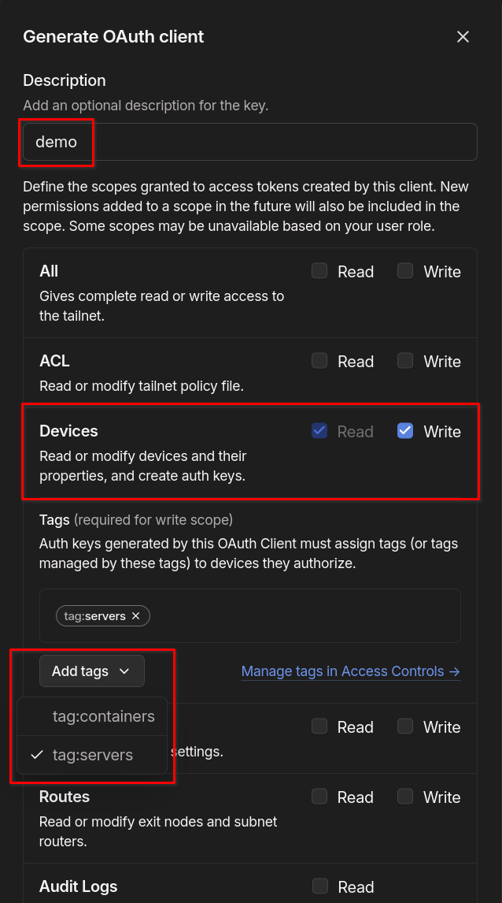

# Tailscale
My homelab playbook and [roles](https://galaxy.ansible.com/ui/repo/published/joshrnoll/homelab/) are built around my usage of [Tailscale](https://tailscale.com). Both servers and containers are automatically added to my tailnet. This is done with a mix of the [artis3n.tailscale](https://galaxy.ansible.com/ui/standalone/roles/artis3n/tailscale/) module (for physical machines and VMs) and using a Tailscale 'sidecar' container to connect containers directly to my tailnet as outlined in this [article](https://tailscale.com/blog/docker-tailscale-guide). 

### Creating an OAuth Client
Authentication to tailscale through these methods requires an [OAuth client](https://tailscale.com/kb/1215/oauth-clients) secret to be created in the Tailscale admin console. We'll create one OAuth client for servers, and one for containers. Once logged in, select ***Settings*** then ***Generate OAuth client...***


Ensure you give the OAuth Client ***Read and Write access to Devices***. If you don't have any tags to pick from, see the below section on configuring tags and circle back to this section when you're done.



Create one OAuth client for your servers, and tag it with the *servers* tag. Do the same for containers. 

### Configuring Tags

When creating an OAuth client, you need to select a [tag](https://tailscale.com/kb/1068/tags). **Your tailnet will not have any tags configured by default.** 

Creating an OAuth key requires creating an [ACL tag](https://tailscale.com/kb/1068/acl-tags?q=acl%20tags) in your tailscale access controls file. This can be done by selecting the ```Access controls``` tab in the Admin console and editing the file directly in the Web UI. The section for tags will be commented out by default, and will look something like this:

```	
// Define the tags which can be applied to devices and by which users.
	//"tagOwners": {
	//  	"tag:example":["autogroup:admin"],
	// },
```
Uncommenting this section and making no changes will tag anything owned by the autogroup:admin as **example**. You can leave it this way if you need the flexibility of allowing multiple different admins the ability to create OAuth clients and adding things to your tailnet. However, for a homelab, I recommend you restrict this to your account only. To do this, change ```"autogroup:admin"``` to the email of your Tailscale admin account. 

The below example does this and creates two tags: one for servers and one for containers. 

```
// Define the tags which can be applied to devices and by which users.
	"tagOwners": {
		"tag:containers": ["your.email@example.com"],
		"tag:servers":    ["your.email@example.com"],
	},
```
You can call the tags anything you want. You just have to tag the OAuth key with *something*. You can also choose to add multiple tags to an Oauth client. 

#### Authkey

Optionally, you can also use a tailscale [auth key](https://tailscale.com/kb/1085/auth-keys), however these have a maximum lifetime of 90 days. ***Functionality with my tailscale roles and playbooks is only tested with OAuth clients.*** 

### Adding Your Secret to Ansible Vault

Once you've created your OAuth Client or Authkey, make note of the secret. We'll store it in an encrypted ansible vault file with the command:<br>

```
ansible-vault create secrets.yml
```
The contents of the file should look like this:

```YAML
tailscale_containers_oauth_client:
	key: <your oauth client secret here>
tailscale_servers_oauth_client:
	key: <your oauth client secret here>
```

I discovered in testing that the variable containing your authkey must be in dictionary/hash format for it to work with the [artis3n.tailscale](https://galaxy.ansible.com/ui/standalone/roles/artis3n/tailscale/) role.